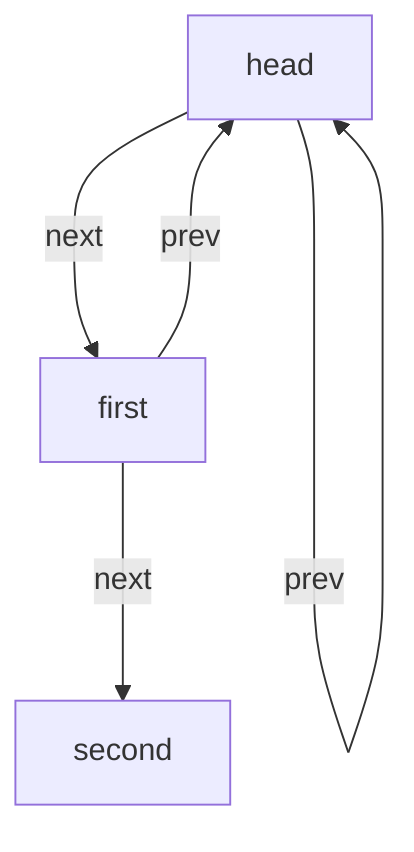

# Kmem Alloc

seperate the kmem linklist to NCPU array. each linklist with a spinlock for alloc and free for each cpu.

need to use `push_off()` and `pop_off()` to reenter the irq area so that cpuid is valid.

if stealing need to be performed, a 2PL form will be applied to make sure deadlock will not happen.

`kfree()` is just push the free page to linklist seperated by cpuid.

# Bcache

Use a 13 length linklist to keep cache reading is simple.

hashed by blkno.

The linklist is look like:

when stealing need, just use ordered locking to keep the lock which resource will not racing with self when also meet cache missing.

when stealing page, remember to move it to current blkno linklist.

remember to give up the look when you start to probe the free page.

