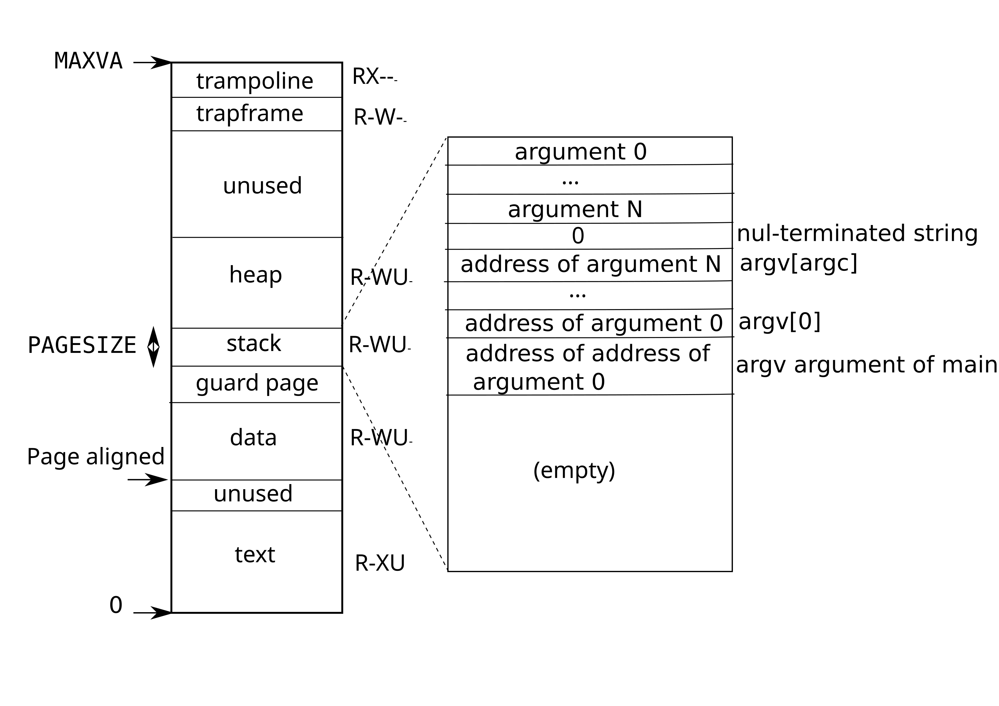

# Usystemcall

just a new mem page after trapframe.

# Vmprint

9 * 3 + 12 bit for va to update.

# Super Page

just add a path for super page allocating and mapping in proc grow.

I assign 8 superpage lower than PASTOP. use pa > SUPERPGSTART to find out super page on umdealloc and umcopy.

Add a new function called supermappages for super page mapping, similar to meppages, but just walk to level 1 to create new page for level 1 page table. Remember to set PTE_V and PTE_R for super pages.

For superpages allocating, I created a new freelist as same as the current freelist.

# Problem

1. For every page table entry in the print_pgtbl output, explain what it logically contains and what its permission bits are.

	Note that low bit actually is UXWRV order.

	

```less
va 0x0 pte 0x21FC7C5B pa 0x87F1F000 perm 0x5B
va 0x1000 pte 0x21FC7017 pa 0x87F1C000 perm 0x17
va 0x2000 pte 0x21FC6C07 pa 0x87F1B000 perm 0x7
va 0x3000 pte 0x21FC68D7 pa 0x87F1A000 perm 0xD7
va 0x4000 pte 0x0 pa 0x0 perm 0x0
va 0x5000 pte 0x0 pa 0x0 perm 0x0
va 0x6000 pte 0x0 pa 0x0 perm 0x0
va 0x7000 pte 0x0 pa 0x0 perm 0x0
va 0x8000 pte 0x0 pa 0x0 perm 0x0
va 0x9000 pte 0x0 pa 0x0 perm 0x0
va 0xFFFF6000 pte 0x0 pa 0x0 perm 0x0
va 0xFFFF7000 pte 0x0 pa 0x0 perm 0x0
va 0xFFFF8000 pte 0x0 pa 0x0 perm 0x0
va 0xFFFF9000 pte 0x0 pa 0x0 perm 0x0
va 0xFFFFA000 pte 0x0 pa 0x0 perm 0x0
va 0xFFFFB000 pte 0x0 pa 0x0 perm 0x0
va 0xFFFFC000 pte 0x0 pa 0x0 perm 0x0
va 0xFFFFD000 pte 0x21FD4C13 pa 0x87F53000 perm 0x13
va 0xFFFFE000 pte 0x21FD00C7 pa 0x87F40000 perm 0xC7
va 0xFFFFF000 pte 0x2000184B pa 0x80006000 perm 0x4B
```

2. Which other xv6 system call(s) could be made faster using this shared page? Explain how.

	sys_fstat. Each open file will copy the file stat to the usyscall page that when need to read fstat, just read from user pagetable.

3. For every leaf page in the vmprint output, explain what it logically contains and what its permission bits are, and how it relates to the output of the earlier print_pgtbl() exercise above

	The pte point to a physical address that contain about 512 pte page table. Each pte has not RWX but leaf. If intermedia node has RWX prems or leaf node has not RWX, they are invalid and do not be printed.
